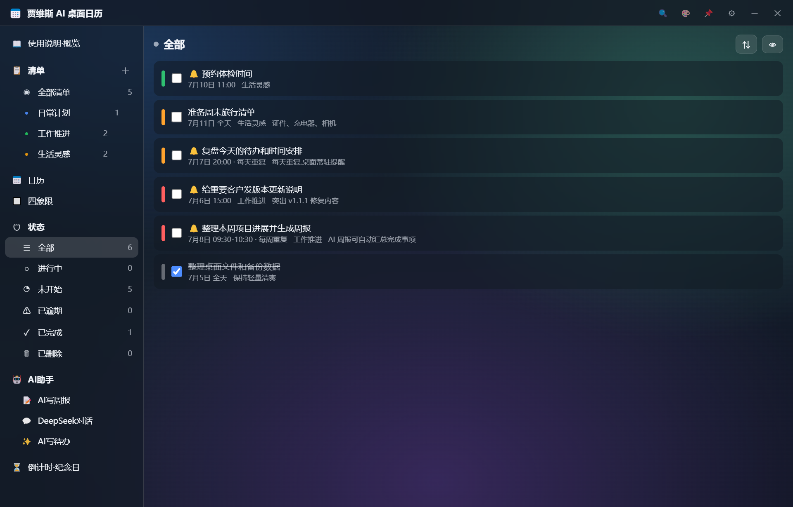
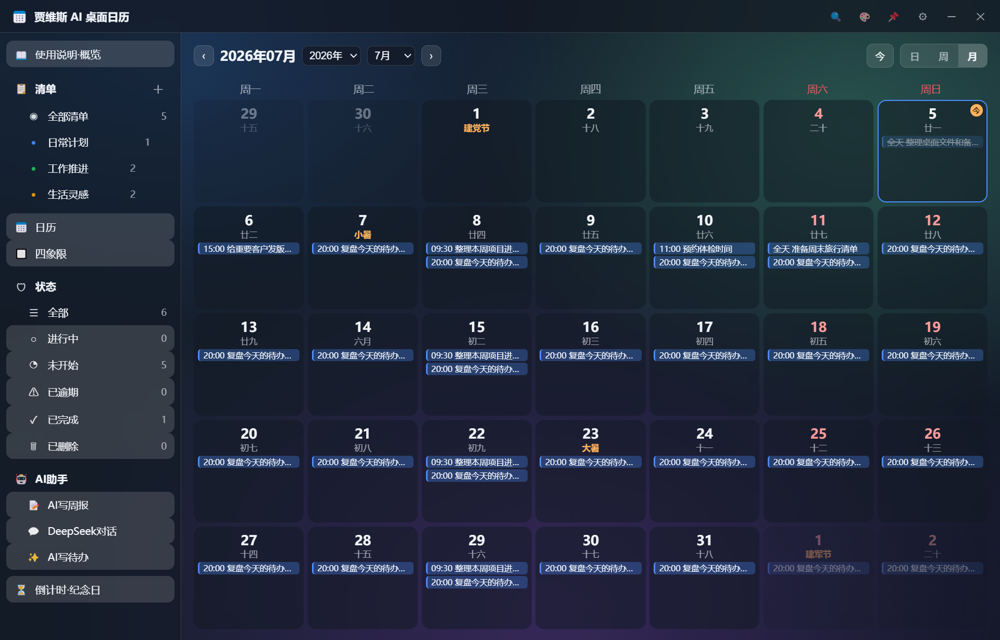
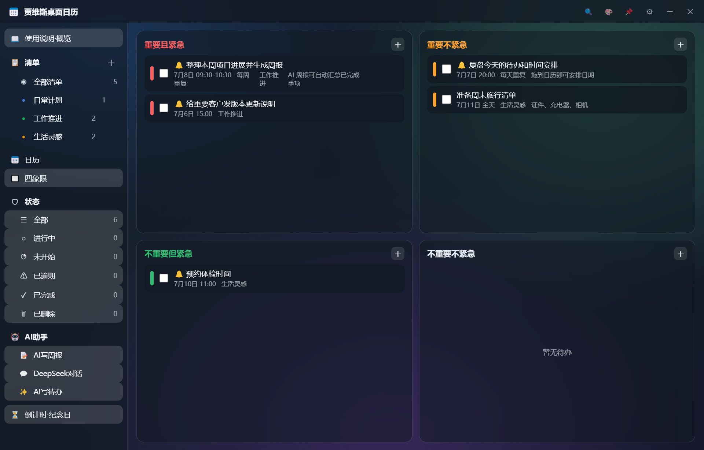
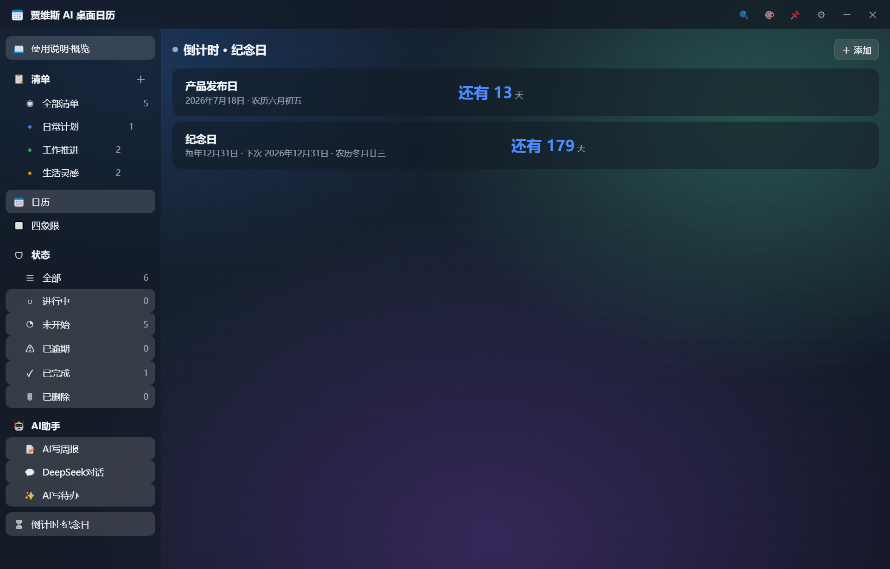
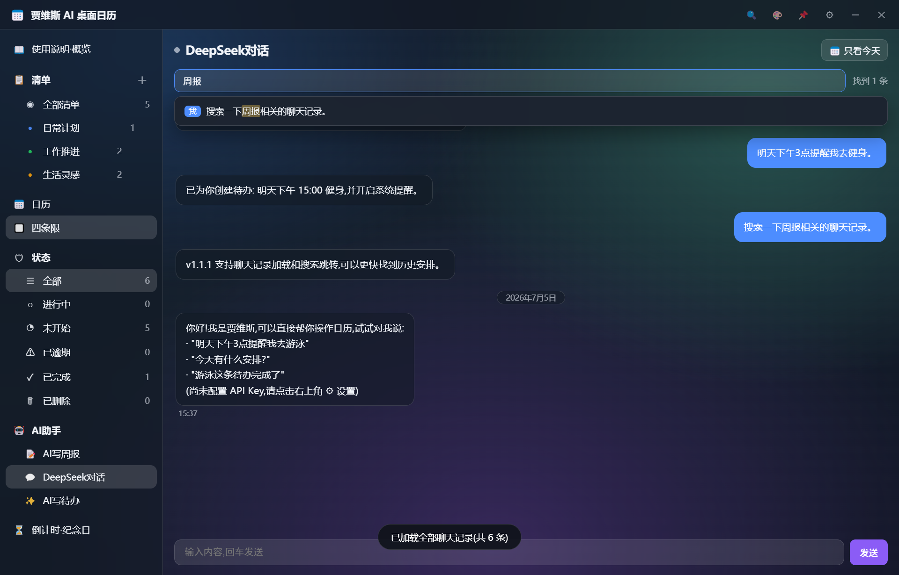

# 贾维斯 AI 桌面日历


会提醒、会规划、会写周报的 Windows 桌面效率助手。

它把待办清单、日历排程、四象限、倒计时纪念日、系统提醒和 AI 助手放在同一个桌面窗口里，适合学生、上班族、项目管理和日常计划。

如果你正在找“好用的桌面日历”“Windows 桌面日历提醒软件”“电脑桌面日程管理工具”或“开源 Electron 桌面小组件项目”，这个项目就是为这些场景做的：免费、开源、本地保存数据，也适合拿来学习 Electron 桌面应用开发。

目标：先冲 50 个 Star。  
如果这个工具对你有帮助，欢迎点一个 Star，后续会继续更新更好用的桌面效率功能。



## 下载

Windows 用户可以直接下载运行版：

[下载 Windows 压缩包](https://github.com/jilmiy/jarvis-ai-calendar/releases/download/v1.1.1/jarvis-ai-calendar-v1.1.1-win-x64.zip)

解压后双击 `贾维斯 AI 桌面日历.exe` 即可运行，不需要安装 Node.js。

## 核心亮点

- 桌面常驻：透明无边框窗口，支持置顶、托盘、靠边自动隐藏。
- 待办清单：多清单管理、状态筛选、快速添加、完成、删除、恢复。
- 日历排程：月视图、周视图、日视图，支持农历、节气、节假日和调休标记。
- 时间提醒：支持日期、时间、全天、重复事项和系统通知。
- 四象限管理：按重要和紧急组织任务，适合每日优先级规划。
- 倒计时纪念日：支持公历、农历和每年重复。
- AI 助手：可配置 DeepSeek API Key，用于对话、写待办、生成周报。
- 本地数据：数据保存在本机，支持自定义数据目录和备份导入导出。

## v1.1.1 更新亮点

- 优化靠边隐藏和弹出逻辑，多屏使用时更稳定。
- 修复窗口停靠后容易遮挡其他软件的问题。
- 增强 AI 聊天记录能力，支持加载往期记录和搜索跳转。
- 优化若干界面细节和交互体验。

## 截图

| 日历排程 | 四象限管理 |
| --- | --- |
|  |  |

| 倒计时纪念日 | AI 助手 |
| --- | --- |
|  |  |

## 适合谁

- 想把待办、日程和提醒放在桌面上的人。
- 需要农历、节气、节假日信息的中文用户。
- 喜欢用四象限安排优先级的人。
- 想用 AI 辅助整理待办、生成周报的人。
- 不想把私人计划同步到云端的人。

## 本地开发

```bash
npm install
npm start
```

Windows 用户也可以双击 `启动日历.bat` 启动开发版。

## 数据与隐私

应用数据默认保存在本机用户数据目录，可在设置中更改保存位置。AI 功能需要用户自行配置 DeepSeek API Key；未配置时，日历、待办、提醒、倒计时等核心功能仍可正常使用。

## 支持项目

如果这个小工具帮你把桌面和计划变清爽了，欢迎：

- 点 Star 支持项目。
- 分享给朋友或同事。
- 在 Issue 里反馈建议和问题。

推广素材和发布文案见 [docs/PROMOTION.md](docs/PROMOTION.md)。
